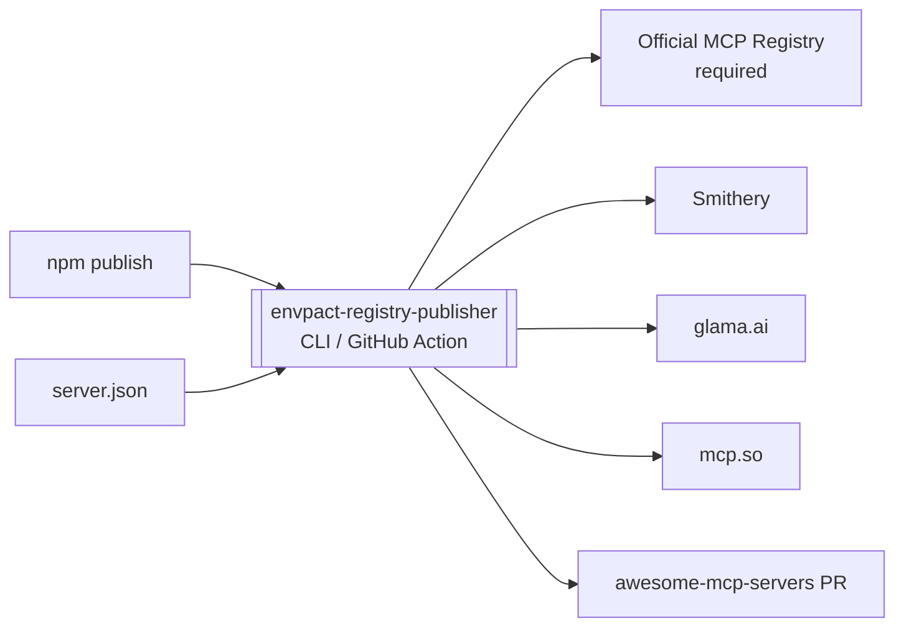

# envpact-registry-publisher

> Publish once, appear everywhere — programmatically submit an MCP server to every public MCP registry on every npm publish, so you never hand-fill six web forms again.

[](./LICENSE)
[](https://github.com/chirag127/envpact-registry-publisher-npm-cli/stargazers)
[](https://github.com/chirag127/envpact-registry-publisher-npm-cli/commits)
[](https://www.typescriptlang.org)
[](https://nodejs.org)
[](https://envpact-registry-publisher-npm-cli.oriz.in)

Programmatic submission of MCP servers to every public MCP registry —
on every npm publish, automatically.

**Links:** [Repo](https://github.com/chirag127/envpact-registry-publisher-npm-cli) · [Live docs](https://envpact-registry-publisher-npm-cli.oriz.in) · [envpact umbrella](https://chirag127.github.io/envpact/)

Replaces the manual `MCP_REGISTRY_SUBMISSION.md` checklist with a
single CLI + GitHub Action that runs at the tail of `envpact-mcp`'s
publish workflow (or anyone else's).

⭐ **If this is useful, please [star the repo](https://github.com/chirag127/envpact-registry-publisher-npm-cli/stargazers)** — it helps other developers find it.

## How it works



## Why this exists

The MCP-registry ecosystem in 2026 is split across:

| Registry | Submission method |
| :--- | :--- |
| Official MCP Registry (`registry.modelcontextprotocol.io`) | `mcp-publisher` CLI + `server.json` |
| Smithery (`smithery.ai`) | API endpoint + bearer token (Playwright fallback if API rejects) |
| glama.ai | Passive — auto-indexes from the official registry |
| PulseMCP | Passive — same |
| mcp.so | Web form only (Playwright drives it) |
| `punkpeye/awesome-mcp-servers` | Pull request (driven by `gh` CLI) |

Doing six different things by hand on every release does not scale.

## Install

```bash
npm install -g envpact-registry-publisher
```

Or run as a GitHub Action:

```yaml
- uses: chirag127/envpact-registry-publisher@v0
  with:
    server-json: ./server.json
  env:
    SMITHERY_API_KEY: ${{ secrets.SMITHERY_API_KEY }}
    MCP_PUBLISHER_TOKEN: ${{ secrets.MCP_PUBLISHER_TOKEN }}
    GH_PAT: ${{ secrets.GH_PAT_FOR_PR }}
```

## Use

```bash
envpact-registry-publish ./server.json
```

The CLI walks every adapter in priority order, reports per-registry
status, and exits non-zero if any required adapter fails. It is safe
to re-run — every adapter is idempotent.

## What `server.json` looks like

```json
{
  "name": "io.github.chirag127/envpact-mcp",
  "description": "Centralised secrets manager for AI agents.",
  "version": "0.4.0",
  "homepage": "https://envpact.oriz.in",
  "repository": "https://github.com/chirag127/envpact-mcp",
  "npm_package": "envpact-mcp",
  "license": "MIT",
  "categories": ["productivity", "developer-tools"],
  "install": {
    "command": "npx",
    "args": ["-y", "envpact-mcp"]
  }
}
```

## Architecture

`src/registries/` has one TypeScript adapter per registry; `runner.ts`
runs them in priority order; `cli.ts` is the entrypoint.

Adapters are best-effort. The official registry adapter is
`required: true` (failure exits non-zero). All others are
`required: false` (failure is logged with a manual-submission link
but doesn't break the run). Per the design choice "fail loud — any
required registry error fails the run".

## Authentication

| Adapter | Variable | Source |
| :--- | :--- | :--- |
| Smithery (REST) | `SMITHERY_API_KEY` | https://smithery.ai/dashboard → Settings |
| Smithery (Playwright fallback) | uses cached browser session | optional |
| Official Registry | `MCP_PUBLISHER_TOKEN` | (preview — pending) |
| `awesome-mcp-servers` PR | `GH_PAT` | GitHub PAT, repo scope |
| mcp.so Playwright | uses cached browser session | optional |

Tokens are read at run-time only; never committed. **No secret values
live in this repo.**

## Tech stack

- **TypeScript** (>=Node 20), ESM; compiled to `dist/`.
- One adapter per registry under `src/registries/`.
- **Playwright** (optional dependency) for UI-form fallbacks (Smithery / mcp.so).
- Ships both an npm bin (`envpact-registry-publish`) and a composite GitHub Action (`action.yml`).

## Repo structure

```
src/cli.ts            # CLI entrypoint (envpact-registry-publish bin)
src/runner.ts         # runs adapters in priority order
src/types.ts          # shared types
src/registries/       # one adapter per registry:
  official.ts         #   required: true (fails run on error)
  smithery.ts         #   REST + Playwright fallback
  glama.ts pulsemcp.ts#   passive
  mcpso.ts            #   Playwright web form
  awesome.ts          #   gh CLI pull request
action.yml            # composite GitHub Action
server.json.example   # sample descriptor
```

## Related projects — the envpact ecosystem

| Repo | Role |
| :--- | :--- |
| [envpact](https://github.com/chirag127/envpact) | Core (Python) vault library |
| [envpact-npm-cli](https://github.com/chirag127/envpact-npm-cli) | Zero-dependency Node CLI (`envpact-cli`) |
| [envpact-mcp-server](https://github.com/chirag127/envpact-mcp-server) | MCP server for AI agents |
| [envpact-gh-action](https://github.com/chirag127/envpact-gh-action) | GitHub Action — resolve secrets in CI |
| **envpact-registry-publisher-npm-cli** | Publish MCP servers to every registry (this repo) |

## Part of the oriz family

One of ~80 [oriz](https://blog.oriz.in) projects — small, sharp,
open-source tools. The live docs run **$0 on the Cloudflare free tier**.

## Contributing

PRs welcome. Conventional commits are the changelog.

## Status

**Beta.** Adapters are best-effort; the official registry adapter is
required and fails the run loudly on error.

## License

MIT © 2026 Chirag Singhal · chirag@oriz.in — see [LICENSE](./LICENSE).

## Documentation

- **[Repo docs (`docs/README.md`)](./docs/README.md)** — full reference for envpact-registry-publisher
- **[Project umbrella site](https://chirag127.github.io/envpact/)** — overview of all envpact components
